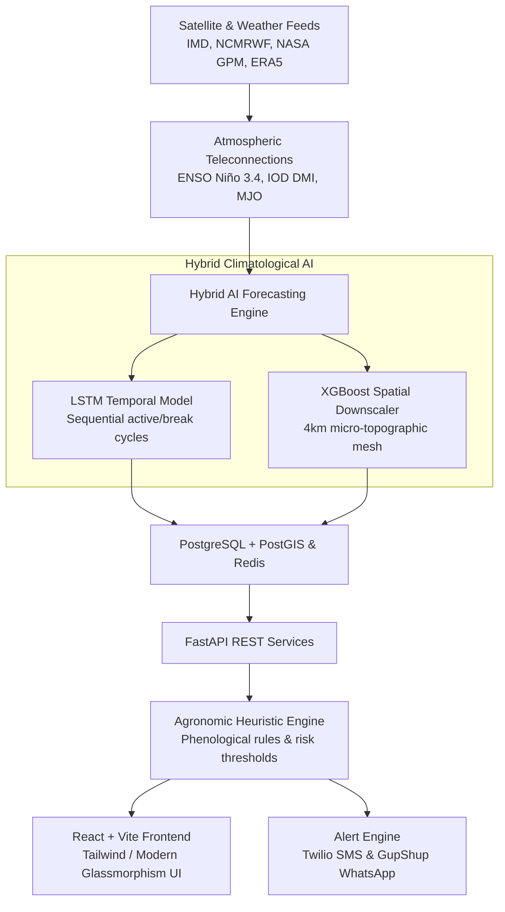

# 🌧️ MonSense — Hyperlocal Monsoon Prediction & Crop Advisory Platform

[](https://monsense.pages.dev/)
[](https://monsense.pages.dev/)
[](https://monsense.pages.dev/)
[](https://fastapi.tiangolo.com/)
[](https://vitejs.dev/)

> **Smart India Hackathon 2026 | Problem Statement ID: 26086**  
> **Team:** APPEX ALLIANCE  
> **🌐 Live Deployment:** [MonSense — Hyperlocal Monsoon Prediction](https://monsense.pages.dev/)

---

## 📌 Overview

**MonSense** is an AI-powered agro-meteorological intelligence platform designed to protect Indian smallholder farmers against erratic monsoon behavior and climate volatility. 

Traditional meteorological forecasts operate on coarse **25–50 km regional grids**, frequently missing localized rainfall anomalies, sudden cloudbursts, and acute mid-season dry spells. This coarse resolution causes:
* **False-Onset Sowing:** Farmers sow early following pre-monsoon showers, only to suffer seed scorching during unexpected 2-week dry spells.
* **Terminal Heat & Moisture Stress:** Lack of timely block-level warnings prevents timely protective irrigation or drainage preparation.
* **Economic Catastrophe:** High input losses (seeds, fertilizers, diesel) driving farmer debt.

MonSense bridges this last-mile gap by downscaling weather models to **hyperlocal 4 km block/village grids**, forecasting precipitation **7 to 30 days in advance**, and translating atmospheric data into **crop-stage actionable advisories** delivered in regional languages (मराठी, हिन्दी, English).

---

## 🚀 Live Demo & Access

* **🌐 Production Frontend:** [MonSense — Hyperlocal Monsoon Prediction](https://monsense.pages.dev/)
* **🖥️ Local Frontend:** `http://localhost:5173`
* **⚙️ Backend API:** `http://localhost:8000`
* **📖 Interactive API Docs (Swagger):** `http://localhost:8000/docs`

---

## ✨ Key Features & Innovation

### 1. 🗺️ Interactive GIS Risk Probability Heatmap
* **Sub-District & Panchayat Resolution:** High-definition interactive Leaflet map with color-coded risk indices (*Low, Moderate, High, Severe*).
* **Cascading Pan-India Location Selector:** Covers all **30 States and Union Territories**, cascading down to districts and blocks.
* **Visual Polygon Highlighting:** Dynamic GeoJSON district and block boundary overlays.

### 2. 📈 7–30 Day Rainfall Forecast Studio
* **Probabilistic Rain Projections:** Dual-curve visualization with widening confidence cones (interquartile uncertainty ranges).
* **Inversely Correlated Probabilities:** Real-time probability bars contrasting heavy rainfall risks vs. prolonged dry spells.

### 3. 🌱 Phenological Crop-Specific Advisory Engine
* **Growth-Stage Contextual Advice:** Tailored recommendations across 8 major Indian crops (*Soybean, Cotton, Rice, Wheat, Sugarcane, Maize, Groundnut, Pulses*).
* **Critical Operation Guidance:** Actionable advice categorized by urgency (*Urgent, Warning, Advisory, Favorable*) covering sowing postponement, pesticide spraying windows, drainage management, and irrigation scheduling.

### 4. 🧪 Interactive "What-If" Scenario Simulator
* Sandbox allowing agricultural extension officers to adjust hypothetical rainfall levels (0–200 mm) and dry spell lengths (0–14 days) to immediately inspect simulated crop impacts and mitigation plans.

### 5. 📱 Visual Multilingual Alert & Telecom Simulator
* Realistic smartphone bezel displaying simulated **SMS** and **WhatsApp** alerts in **Marathi (मराठी)**, **Hindi (हिन्दी)**, and **English**.
* Simulated rural telecom gateway terminal showcasing packet routing and live delivery receipts.

### 6. 🔄 Dual Data Engine (Live Weather vs. Calibrated Offline Demo)
* **Live Telemetry HUD:** Direct integration with global NWP models (Open-Meteo ECMWF/GFS) providing real-time maximum temperature, today's rain, volumetric soil moisture, and API latency.
* **Zero-Downtime Mock Fallback:** Graceful fallback to rich offline presets ensuring 100% demo reliability even without local database or backend connectivity.

---

## 🏗️ Technical Architecture & Hybrid AI Pipeline



### 🧠 Machine Learning Engine:
1. **Long Short-Term Memory (LSTM) Networks:** Captures non-linear temporal dependencies, monsoon onset dynamics, and macro teleconnection cycles (ENSO, IOD, MJO).
2. **XGBoost Spatial Downscaler:** Resolves coarse 25–50 km atmospheric forecasts down to a fine 4 km mesh using local digital elevation models (DEM), slope aspect, terrain roughness, and land use.

---

## 💻 Tech Stack

| Layer | Technologies |
| :--- | :--- |
| **Frontend** | React 18, Vite, Leaflet.js, React-Leaflet, Recharts, Lucide Icons, Glassmorphic CSS |
| **Backend** | Python 3.11, FastAPI, Uvicorn, Pydantic v2 |
| **ML & Analytics** | Scikit-learn, XGBoost, NumPy, Pandas, GeoAlchemy2, Shapely, PyProj |
| **Database & Cache** | PostgreSQL 15 + PostGIS 3.4, Redis 7 |
| **Data Sources** | Open-Meteo API (ECMWF/GFS), IMD, NCMRWF, NASA GPM-IMERG, ECMWF ERA5 |
| **Alert Delivery** | Twilio API (SMS), GupShup API (WhatsApp) |
| **Hosting & DevOps** | Cloudflare Pages (Frontend CDN), Docker & Docker Compose, Render |

---

## 🚀 Getting Started (Build & Run Locally)

### Prerequisites
* **Node.js** 18+ and **npm**
* **Python** 3.11+ (optional if using Docker)
* **Docker & Docker Compose** (recommended for full-stack)

---

### Option 1: One-Click Run with Docker (Recommended)

To start the entire platform (PostGIS Database, Redis, FastAPI Backend, and React Frontend):

```bash
# Clone the repository
git clone https://github.com/Om-pandey-developer/MonSense-MVP.git
cd MonSense-MVP

# Build and run all services
docker-compose up --build
```

Access services at:
* **Frontend:** `http://localhost` or `http://localhost:5173`
* **Backend API:** `http://localhost:8000`
* **Swagger API Docs:** `http://localhost:8000/docs`

---

### Option 2: Manual Local Setup

#### 1. Frontend Setup
```bash
cd frontend

# Install dependencies
npm install

# Run Vite development server
npm run dev

# Build for production
npm run build
```
The frontend will start at `http://localhost:5173/`.

#### 2. Backend Setup
```bash
cd backend

# Create and activate virtual environment
python -m venv venv
# On Windows:
venv\Scripts\activate
# On Linux/macOS:
source venv/bin/activate

# Install dependencies
pip install -r requirements.txt

# Run FastAPI backend
uvicorn app.main:app --reload --host 0.0.0.0 --port 8000
```
Backend will start at `http://localhost:8000/`.

---

## ☁️ Deployment Guide

### Deploying Frontend to Cloudflare Pages (Current Setup)

The frontend is live at [https://monsense.pages.dev/](https://monsense.pages.dev/).

To deploy to Cloudflare Pages:
1. Connect your GitHub repository to Cloudflare Pages.
2. Configure the build settings:
   * **Framework preset:** `Vite` (or `None`)
   * **Build command:** `npm run build`
   * **Build output directory:** `dist`
   * **Root directory:** `frontend`
3. Add Environment Variable:
   * `NODE_VERSION` = `20`
4. Click **Save and Deploy**. Single Page Application (SPA) routing is handled automatically via `frontend/public/_redirects`.

---

## 📂 Project Directory Structure

```text
MonSense-MVP/
├── frontend/                     # React + Vite Frontend
│   ├── public/                   # Static assets & Cloudflare _redirects
│   ├── src/
│   │   ├── components/           # UI Components (RiskMap, Advisory, Simulators)
│   │   ├── context/              # Global state (AppContext.jsx)
│   │   ├── services/             # API clients & comprehensive mock data
│   │   ├── hooks/                # Custom React hooks
│   │   ├── App.jsx               # Main dashboard controller
│   │   └── index.css             # Design tokens & glassmorphism styling
│   ├── package.json
│   ├── vite.config.js
│   └── Dockerfile
├── backend/                      # FastAPI Backend
│   ├── app/
│   │   ├── main.py               # FastAPI entrypoint & middleware
│   │   ├── config.py             # Environment configurations
│   │   ├── database.py           # PostGIS engine & Redis client
│   │   ├── routers/              # Modular REST routes (forecast, advisory, alerts)
│   │   ├── ml/                   # ML inference pipeline & agronomic heuristics
│   │   ├── models/               # SQLAlchemy ORM models
│   │   └── schemas/              # Pydantic validation schemas
│   ├── requirements.txt
│   └── Dockerfile
├── docker-compose.yml            # Multi-container orchestration (DB, Redis, Backend, Frontend)
├── sync_pan_india.py             # Geospatial synchronization script
└── README.md                     # Project documentation
```

---

## 📡 REST API Reference

| Method | Endpoint | Description |
| :--- | :--- | :--- |
| `GET` | `/health` | System health check and uptime status |
| `GET` | `/api/v1/dashboard/stats` | Macro monsoon indices, ENSO, IOD, active alerts |
| `GET` | `/api/v1/forecast/predict/{code}` | 7–30 day rainfall projection for specific block |
| `GET` | `/api/v1/forecast/risk-map` | GeoJSON risk probability heatmap layers |
| `GET` | `/api/v1/advisory/generate/{code}`| Phenological crop advisory recommendations |
| `GET` | `/api/v1/locations/` | Cascading state, district, and block hierarchy |
| `GET` | `/api/v1/alerts/stats` | Dispatched alert metrics and channel breakdown |

---

## 🎯 Socio-Economic Impact

* **Resilience for Marginal Farmers:** Protects farmers with < 2-hectare rainfed land holdings against early-season sowing failures.
* **Optimized Input Utilization:** Reduces wasted expenditure on seeds, fertilizers, and unnecessary diesel-powered irrigation.
* **Ground-Level Extension Support:** Equips Krishi Vigyan Kendras (KVKs) and Panchayat officers with high-resolution localized risk intelligence.
* **Food Security:** Mitigates aggregate yield variability across India's primary Kharif and Rabi food grains.

---

## 📜 License & Acknowledgments

This project is developed for the **Smart India Hackathon (SIH) 2026** by **Team APPEX ALLIANCE**.  
Licensed under the [MIT License](LICENSE).

### Data Attribution:
* **IMD** (India Meteorological Department)
* **NCMRWF** (National Centre for Medium Range Weather Forecasting)
* **ECMWF** (European Centre for Medium-Range Weather Forecasts) — ERA5 Reanalysis
* **NASA** (National Aeronautics and Space Administration) — GPM-IMERG Precipitation
* **Open-Meteo** — Atmospheric Numerical Weather Prediction APIs
